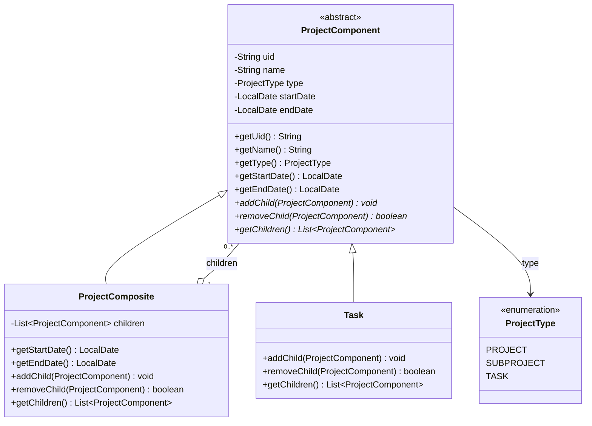
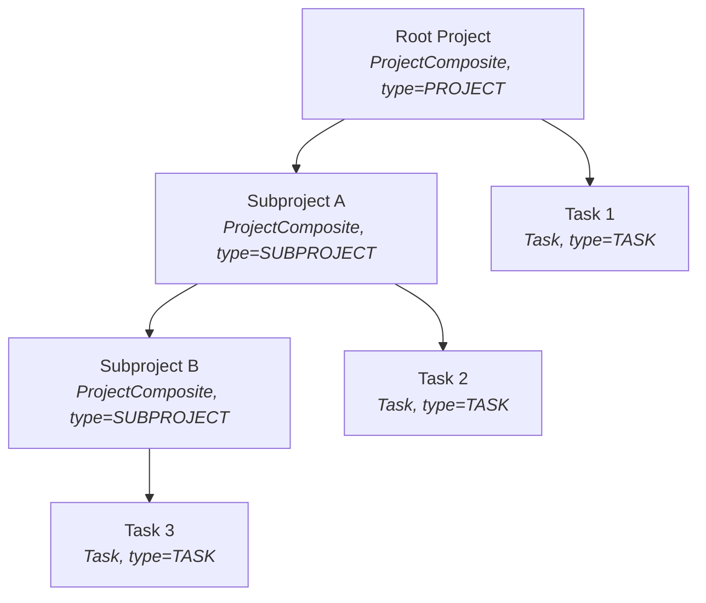

# composite-dp-version — Rebuilding the Project Hierarchy with the Composite Pattern

## Why this branch exists

The `master` branch's solution models every node (Project, Subproject, Task)
as a single flat entity class with a `type` discriminator — a pragmatic
choice that maps directly onto the assignment's flat JSON contract and keeps
JPA/H2 persistence simple.

This branch asks a different question: **what does this same problem look
like if it's modeled with the [Composite design
pattern](https://refactoring.guru/design-patterns/composite) instead?** It's
a practice exercise, not a resubmission — the goal was to see whether a
"more correct" OO structure actually pays for itself here, or whether it's
over-engineering a problem that's genuinely simpler as flat data. My take,
after building it: for *this* hierarchy, Composite earns its keep. The
reasoning is below.

## Why Composite fits this problem specifically

The assignment's structure is a textbook Composite scenario:

- A **Project** or **Subproject** can contain any number of Subprojects
  and/or Tasks.
- A **Task** is always a leaf — it can never have children.
- Several operations (compute start/end dates, compute completion %, render
  the hierarchy as JSON) need to work **identically** whether they're called
  on a leaf or a branch, recursing transparently through the tree.

That last point is the crux of Composite: client code shouldn't need to ask
"is this a Task or a Project?" before deciding how to compute its dates or
serialize it. It should just call `.getStartDate()` or `.getChildren()` and
let each node's own class decide what that means for it.

## The class hierarchy

```
ProjectComponent (abstract)
├── Task            — leaf; dates are stored, set at construction
└── ProjectComposite — branch; dates are computed from children, never stored
```



`ProjectComposite.getStartDate()`/`getEndDate()` override the base class
with the recursive min/max-over-children logic; `Task` doesn't override
them at all — it simply returns the dates it was constructed with. Neither
overrides `getUid()`/`getName()`/`getType()`, both fall through to
`ProjectComponent`'s field-backed versions unchanged.

### A concrete instance

The diagram above is the *shape*; here's what an actual loaded tree looks
like — note that `PROJECT` and `SUBPROJECT` are both `ProjectComposite`
instances, distinguished only by `ProjectType`, while every `Task` is a
`Task` leaf regardless of how deep it sits:



Calling `getStartDate()` on the Root Project recurses through S1, which
recurses through S2, which reads T3's own stored date directly — the same
`getStartDate()` call, dispatched polymorphically at every level, with no
`type`-branching anywhere in that call chain.

In more detail:

- **`ProjectComponent`** holds the fields common to every node (`uid`,
  `name`, `type`, `startDate`, `endDate`) and declares the Composite
  contract as abstract methods: `addChild`, `removeChild`, `getChildren`.
- **`Task`** is a leaf: `addChild`/`removeChild` throw
  `UnsupportedOperationException`, and its dates are simply the ones it was
  given.
- **`ProjectComposite`** represents both a root **Project** and a nested
  **Subproject** — structurally they're the same class; only their
  `ProjectType` differs (see below). Its `getStartDate()`/`getEndDate()` are
  **computed live**, recursively, as the min/max over its children — there
  is no setter for either. Ask a `ProjectComposite` for its dates at any
  point and you get the true current answer, automatically reflecting any
  add/remove that happened anywhere beneath it.

## Key design decisions (and the reasoning behind them)

A handful of choices in this rework were deliberate departures from what a
direct, flat translation of the assignment's JSON model would suggest —
worth calling out explicitly, since they weren't obvious up front.

**`parentUid` is not a field on the domain model.**
The assignment's JSON schema includes `parentUid` per node, but storing it
on `ProjectComponent` would mean every node carries information about its
*position* in the tree as mutable state, duplicating what the tree structure
(`children` lists) already expresses. Instead, `parentUid` is:
- Read from the incoming flat JSON (`ProjectNodeDTO`, a plain,
  Jackson-friendly DTO) only while *building* the tree
  (`ProjectTreeBuilder`), to decide who calls `addChild` on whom.
- Re-derived at *serialization* time only, threaded through the recursive
  JSON-builder as a parameter (`serializeNode(node, parentUid)`), not read
  off the node itself.

**`PROJECT` vs `SUBPROJECT` is a positional distinction, resolved once, at
tree-build time.**
Both are the same `ProjectComposite` class — the only structural difference
is whether a node has a parent. `ProjectTreeBuilder` computes this once,
when constructing each node (`hasParent ? SUBPROJECT : PROJECT`), and passes
it into the constructor. This is deliberately the *only* place that
decision gets made, to avoid two sources of truth for the same fact.

**A Subproject can only be added already carrying at least one child.**
Per the spec ("the Project/Subproject must have at least one Task/Subproject"),
`addNewEntity` rejects a `SUBPROJECT`-typed node with an empty `children`
list. The caller is expected to construct the Subproject with its first
Task already attached (via `addChild`) before submitting it.

**The last remaining child of a Project/Subproject can't be removed.**
`removeEntity` checks the parent's child count before removing, refusing to
leave any composite with zero children — enforcing the same invariant from
the other direction.

**`removeEntity` verifies the caller's claimed parent/child relationship
before trusting it.**
`removeChild` returns a `boolean` (mirroring `List.remove`'s own contract);
if the given `uid` isn't actually a child of the given `parentUid`, the
operation is rejected rather than silently doing nothing while still
reporting success.

**No persistence layer in this branch, on purpose.**
`master` already covers the H2/JPA side of the assignment. This branch is
scoped to the domain model and its behavior; `@Entity`/`@Id`, the JPA
repository, and anything H2-related were deliberately stripped out rather
than fought into cooperating with a polymorphic Composite hierarchy (JPA
inheritance mapping for this shape is real, but not the point of this
exercise).

**`allProjects` is an index, not the source of truth.**
`ProjectsService` keeps one `Map<uid, ProjectComponent>` purely for O(1)
uid-based lookup (needed by every endpoint that addresses a node by uid).
The actual hierarchy lives entirely in the object graph itself
(`root` and each composite's `children`). Any structural mutation
(add/remove) must keep both in sync — the recursive `registerRecursively`/
`removeRecursively` helpers exist specifically for that.

**Serialization is a hand-rolled recursive walk, not automatic Jackson
polymorphism.**
Even though `ProjectComponent` carries `@JsonTypeInfo`/`@JsonSubTypes` (used
for *deserializing* the domain model, historically), the hierarchy-to-JSON
output (`serializeProjectStructure`/`serializeNode`) is written explicitly:
build a `LinkedHashMap` per node, recurse into `children` only if the node
is a `ProjectComposite` (a `Task`'s map simply has no `children` key at
all, rather than an empty one). This gives full control over the exact
output shape the assignment expects, including the derived `parentUid`.

**Centralized exception-to-HTTP-status mapping via `@ControllerAdvice`.**
Rather than wrapping individual controller methods in `try/catch`,
`ProjectsExceptionHandler` maps `IllegalArgumentException`/
`IllegalStateException` (thrown by `ProjectTreeBuilder` for malformed input,
and by `ProjectsService` for an empty hierarchy) to `400 Bad Request`
uniformly, once, for every endpoint that can raise them.

## Testing

This branch also introduced the project's first real unit tests (JUnit 5 +
AssertJ, already available via `spring-boot-starter-test` — no new
dependency needed), replacing what had previously been manual testing only.

`ProjectsServiceTest`:
- `loadAllProjectEntities_registersEveryNodeFromTheFixture` — loads a full
  realistic tree from a JSON fixture and confirms every node is indexed.
- `loadAllProjectEntities_rejectsEmptyPayload`
- `loadAllProjectEntities_acceptsRootWithNoChildrenYet`
- `addNewEntity_addsTaskUnderExistingSubproject`
- `addNewEntity_rejectsSubprojectWithNoChildren`
- `removeEntity_rejectsRemovingTheLastRemainingChild`
- `removeEntity_rejectsWhenParentUidDoesNotMatchTarget`

`ProjectTreeBuilderTest`:
- `buildTree_rejectsMultipleRoots`

## Current status

Working and tested: uploading/parsing a project tree, adding a node under a
given parent, removing a node (with both guard rules), and serializing the
full hierarchy back to JSON.

**Not yet implemented on this branch:**
- Completion percentage calculation (for a given date).
- `ProjectsController` still has several endpoints left over from an
  earlier, incompatible design (flat type-segregated maps, a `parentUid`
  based lookup) that don't yet reflect the current service — a full
  controller rewrite is the next planned step.
- Swagger/OpenAPI documentation.

## A note on when *not* to reach for Composite

This pattern earns its place here because the hierarchy is genuinely
recursive, uniform, and every meaningful operation (dates, completion %,
serialization) needs to treat leaf and branch alike. That won't always be
true. If Task and Project/Subproject had very different behavior sets, or
if persistence via a standard ORM were a hard requirement, a flat
single-class model (as in `master`) — or plain inheritance for a
non-recursive, small, fixed set of types — would likely be the more
pragmatic choice. Worth keeping in mind for future reviews of this repo:
the "right" pattern is a function of the problem's actual shape, not a
default to reach for.
